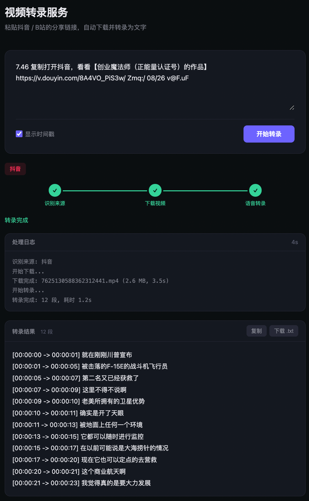

# Video Transcribe Server

粘贴抖音/B站分享链接 → 自动下载 → 转录为文字。

## 效果图



## 启动

```bash
conda activate /gluster_osa_cv/user/jinzili/env/whisperx
```

```python
# GPU mode (default)
CUDA_VISIBLE_DEVICES=4 python server.py --port 8542 --model large-v3

# CPU mode
python3 server.py --port 8542 --model large-v3 --cpu

# With speaker diarization
CUDA_VISIBLE_DEVICES=4 python3 server.py --port 8542 --diarize
```

```
HF Token for diarization (按优先级查找):
    1. --hf-token <token>              命令行参数直接传入
    2. HF_TOKEN=<token>                环境变量
    3. ~/.cache/huggingface/token       由 `huggingface-cli login` 生成的缓存文件
```

打开浏览器访问 `http://<host>:8542` 即可使用。
